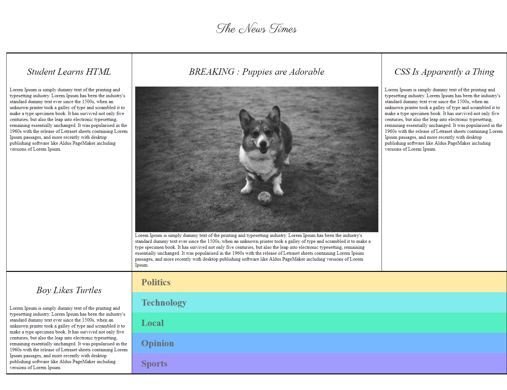

## Article-API-Demo

This project demonstrates how to fetch and display articles using a public API. It showcases essential techniques like making HTTP requests, parsing JSON responses, and rendering the data in a user-friendly format.

### Features

- Fetches data from a public API.
- Displays a list of articles with titles, descriptions, or summaries.
- Clean and responsive layout for article presentation.

### Technologies Used

- **HTML**
- **CSS**
- **JavaScript**

### How to Run the Project

1. Clone the repository:
   ```bash
   git clone https://github.com/BhoomiGohil/Article-API-Demo.git
   ```
2. Open the project folder and run `index.html` in your browser.

## Visual Design



### Credits

This project uses data from a public API.
